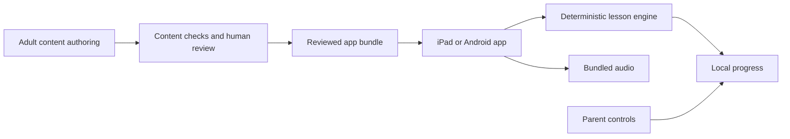

# Read to Lead: product and first-playable design

Date: 2026-09-12. Status: approved design baseline. Current delivery evidence is in
[implementation status](implementation-status.md). This document contains product requirements,
not private family observations. The name is a placeholder, not a cleared brand.
See the [product vocabulary](context.md) for terms used here. Architecture and
product requirements remain the design baseline; planning-time checkout/toolchain
observations below are historical. Use current implementation status and live
verification for execution decisions, and read only the sections relevant to the task.

## Purpose and decision authority

Build an English reading app in which beginning readers help a friendly robot
invent, assemble, and test things. Reading practice should have a visible purpose
and children should enjoy returning without pressure to keep playing.

The owner confirmed beginning reading, guided independence, English-only content,
a robot workshop, iPad priority, and offline lessons. The owner then authorized
the remaining questions to be resolved using recommendations and requested a
completed plan. Choices below are design decisions under that delegation, not
claims that any implementation, purchase, publication, or learning outcome exists.

## Product boundaries

Primary audience: beginning English readers, approximately ages 4-7. Use skill
readiness rather than age to place learners. Narration must allow a non-reader to
navigate. Children may already speak English fluently; do not equate decoding
errors with limited vocabulary or limited general ability.

The first setting is an invention workshop with a friendly robot guide. The
guide uses authored animation and recorded prompts. It is not an open-ended AI
character. The loop is hear/read -> assemble -> test -> celebrate -> finish.

Parent involvement is optional during practice. A parent handles initial setup,
microphone choices, data deletion, and any eventual purchases. A parent view
shows practiced patterns, hints, and what to practice together. It must not
claim a reading age, diagnosis, or validated mastery score.

## Alternatives and selected approach

| Approach | Advantages | Costs | Decision |
| --- | --- | --- | --- |
| React Native and Expo; authored 2D activities | TypeScript reuse, native controls, one iOS/Android codebase, straightforward app screens | Native audio/gesture/device QA still necessary | Selected |
| Flutter, optionally Flame | Strong option for a continuous 2D game | Dart adoption and less reuse of existing TypeScript work | Reconsider only if game demands exceed the selected approach in a measured prototype |
| Separate Swift and Kotlin apps | Direct platform control | Duplicate UI and integration work | Not justified for the initial scope |

Use a single mobile repository, not a multi-service or multi-package platform.
Keep features separated by responsibility inside `src/`. Native components and
simple 2D illustration suffice initially; neither a physics engine nor 3D is
needed. Website tools are optional later, not a prerequisite to testing on iPad.

[Expo's SDK reference](https://docs.expo.dev/versions/latest/) currently pairs SDK
57 with React Native 0.86 and React 19.2.3, with iOS 16.4+, Android 7+, Xcode
26.4+, and Node 22.13+ minimums. These are framework floors, not a claim that
every supported device will meet this app's quality targets. Recheck the stable
toolchain and store requirements when scaffolding. Use Node 24 LTS and npm;
keep the Expo-selected compatible package set in one lockfile.

## Global constraints

- Provisional display name: Read to Lead; repository directory: read-and-lead.
  [Naming conflicts](product-name-review.md) block final adoption pending clearance
  or a new name. Native identifiers remain unchanged.
- Language: English only, with US English model recordings.
- Primary layout/test target: iPad; retain Android and phone layouts.
- Framework baseline: stable Expo SDK 57, Node 24 LTS, npm, strict TypeScript.
- Core lessons must work offline in an installed release build.
- Child runtime has no live generative AI, ads, social features, or purchases.
- Required child reading uses only introduced sound-spelling patterns and explicitly taught irregular words.
- Every drag interaction has a tap-to-select and tap-to-place equivalent.
- Attempt history distinguishes independent, assisted, incorrect, and skipped responses.
- Private learner data, recordings, credentials, and test artifacts stay out of git.
- Physical-device validation is required before declaring native readiness.
- No hardware integrations, math curriculum, account service, or content CDN in the first milestone.

## Instructional design

Teach sounds and their written representations explicitly and cumulatively.
Distinguish letter names from sounds in words. Begin with useful consonants and
short vowels, then add additional patterns; do not present every possible sound
for a letter at once. Model consonants without an unnecessary trailing vowel.
Show lowercase first, pairing uppercase where relevant. Do not use phonetic
transcriptions as child-facing text.

The [IES practice guide](https://ies.ed.gov/ncee/wwc/PracticeGuide/21) supports
sound-letter instruction, decoding and word analysis, and connected reading.
That evidence informs the teaching sequence; it does not establish efficacy for
these specific games. [UFLI](https://ufli.education.ufl.edu/foundations/) is a
useful instructional reference, not a license to copy curriculum or recordings.

Use familiar spoken words when testing decoding. Introduce science vocabulary
orally and demonstrate its meaning before requiring comprehension. Separate
narrator text from learner text in content data. A narrator can say "invention"
without expecting the child to decode it. Pictures may explain meanings but
should not reveal the answer to a decoding check before the attempt.

A proposed ten-lesson pilot sequence follows. It is original planning content
requiring literacy review before child testing, not an approved curriculum:

| Lesson | New patterns | Examples after modeling | Role |
| --- | --- | --- | --- |
| 1 | m, a as in mat, s | am, Sam | Sound matching and first blending |
| 2 | t | mat, sat, at | Add a useful ending sound |
| 3 | p | map, tap, pat | Build short words and act on tap |
| 4 | f, n | fan, pan, nap | Complete a fan invention |
| 5 | i as in sit | sit, pin, fin | Contrast short vowels |
| 6 | d, o as in top | top, dot, did | Further cumulative practice |
| 7 | g, c as /k/ | cat, dog, gap | Familiar nouns decoded from parts |
| 8 | u as in sun | sun, cup, mug | Short u and review |
| 9 | e as in pen | pen, net, ten | Short e and review |
| 10 | Review only | Sam sat. / Tap a pin. | Connected reading and transfer |

"a" as a standalone article has a different spoken form from the short vowel
in "mat"; teach it explicitly before "Tap a pin." Avoid silently treating every
letter occurrence as the same correspondence. Likewise, do not require "the"
until its pronunciation/spelling has been explicitly introduced. Model sentence
capitalization, punctuation, and the name Sam. Add a short connected-text moment
as soon as the learner has the necessary patterns; lesson 10 is cumulative review,
not the first opportunity to read connected text.

Content review has two different checks: a deterministic gate verifies declared
patterns and assets; a human literacy reviewer verifies actual pronunciation,
segmentation, teaching order, decodability, ambiguity, and appropriateness.
Software must not claim to certify phonics correctness from letter membership.

## Milestones and exclusions

### M1: first playable foundation — detailed implementation plan accompanies this spec

- One workshop screen, an authored robot with idle/encourage/celebrate states.
- Two reviewed mini-lessons: sound matching and word building, using lessons 1-2.
- Hear a model; select a letter; build am, Sam, mat, or sat; earn one visible part.
- A guided connected-text example using reviewed known patterns.
- Tap controls plus drag controls that have the same outcome.
- Bundled, reviewed audio and artwork; airplane-mode operation after installation.
- One anonymous local learner slot, attempt history, progress and restart recovery.
- A parent area with a local gate, progress summary, sound settings, and reset.
- Native smoke flow and a manual device checklist, including interrupted playback.
- Microphone off and no microphone permission prompt in M1.

M1 intentionally validates the app/lesson architecture before recording an entire
library or building speech infrastructure. It is not the paid App Store launch.

### M2: family pilot

Expand to ten reviewed lessons, three reusable game types (sound match, word
builder, and read-an-instruction), a short original sing-along with synchronized
highlighting, a build/test animation per mission, and up to three local learner
slots. Add optional microphone listen/repeat/playback, parent-controlled and
unscored. Introduce a review queue driven by recent independent/assisted attempts.
Add parent-observed transfer prompts using unfamiliar combinations of known
patterns. Draft a separate implementation plan for this expansion after M1 results.

### M3: public beta and commercial readiness

After family usability results, target a 30-lesson starter world with at least
five short reviewed decodable texts and enough content to assess willingness to
pay. This scope is a production planning target, not a guarantee of sufficient
value. Add store billing/restore, product/legal/support pages, accessibility
review, device matrix, privacy disclosures and deletion/restore behavior.
Invite a small consented parent cohort only with explicit outreach authorization.
Cross-device accounts and downloadable content packs remain separate projects.

Future math/coding may reuse interaction, audio, content packaging, and parent
controls after an actual second use case exists. Do not build its abstraction,
curriculum, physical Arduino/drone/rocket integrations, or separate app now.

## Session and feedback design

Aim for a 5-10 minute optional session with a natural end, not a required daily
quota. A missed day never removes earned parts. No countdowns, lives, loot boxes,
streak pressure, leaderboards or purchase prompts to children. On an error, model
the relevant sound and let the child try a smaller step. After two unsuccessful
attempts, offer a demonstration or skip; do not create an endless failure loop.
Parent navigation can revisit any taught activity without payment or punishment.

The next lesson is offered after completion, including supported completion.
Review recommendations use attempt evidence, but "completed" is not "mastered."
For M1 show counts, hints, and the practiced pattern only. For M2, a tentative
"ready for review" heuristic may use four of five independent responses across
two sessions; call it a product heuristic and test it, not a validated reading score.

Robot praise names the action ("You put the sounds together") and does not claim
the child read aloud correctly when the app has not verified it. Children can
replay instructions. Music ducks beneath speech. Audio stops when leaving an
activity or backgrounding the app. Reduced motion replaces celebration movement
with an equivalent static reward. Motor speed is not part of reading assessment.

## Data and component contracts

Use authored content versioned with the app. M1 has no server, sign-in, remote
config, over-the-air updates, analytics SDK, or runtime asset download. Later
downloaded lessons must remain usable offline, as agreed; M1 achieves that with
bundled content. Display a clear local-save warning before reset/uninstall;
uninstall may lose progress, and cloud recovery is not promised.

| Boundary | Responsibility |
| --- | --- |
| Content catalog | Validated lessons, patterns, words, prompts, artwork/audio references, review state |
| Activity renderer | Sound match or word builder; emits an attempt; owns no persistence policy |
| Session reducer | Deterministic question order, hints, retry/demo/skip, completion |
| Progress repository | Transactional SQLite writes, idempotent attempts, local summaries |
| Audio controller | One prompt at a time, replay/cancel, background cleanup |
| Workshop | Mission choice, robot reaction, earned parts and session end |
| Parent area | Adult gate, local summaries/settings/reset with confirmation |

Keep lesson version and activity ID on every attempt so new content does not
silently reinterpret old performance. Use random local IDs, not names, birthday,
school, location, or contact data. Local data is still potentially personal data.
Store response category, hint count and selected item IDs; do not log raw speech
or free-text child input. Retain detailed attempts for 90 days, then keep bounded
aggregate counts; provide complete local reset. Do not silently include learning
data in backups; explicitly configure and test OS backup behavior before pilot.

Use `expo-sqlite` transactions for attempt insertion and associated completion
updates. A duplicate attempt ID must not award a part twice. If storage fails,
show "Progress could not be saved" with retry; do not claim it saved. Corrupt or
newer-version databases are not silently overwritten. A parent can explicitly
reset after a clear warning. [SQLite API reference](https://docs.expo.dev/versions/latest/sdk/sqlite/)

## Microphone boundary

M2 adds optional recording and local playback, explicitly labeled practice rather
than assessment. Permission denial and unavailable input preserve the entire
learning path. Parent enablement and OS microphone permission are separate steps.
Never record during idle, background use, or sing-alongs; record only a bounded
user-triggered practice turn, at most ten seconds, with a visible indicator.

`expo-audio` normally writes recordings into app cache. Therefore promise no
upload and no retained recording after practice, not "audio never touches disk."
Keep recordings only in app cache; delete on completion, cancellation, background,
and startup recovery after an interrupted session. Disable the microphone feature
if cleanup cannot be guaranteed for the pilot. Verify cache/backup/network behavior
on devices. [Audio API](https://docs.expo.dev/versions/latest/sdk/audio/)

Automatic read-aloud feedback is a separate feasibility experiment after M1. Test
on-device APIs, not a generic cloud transcription SDK. Apple requires a capability
check before forcing on-device recognition; Android exposes an on-device API
starting at API 31. Unsupported devices fall back to unscored practice. Correctly
transcribing a word is not proof of sound-level pronunciation accuracy. Do not
gate learning, award mastery, or correct accents using an unvalidated recognizer.
[Apple capability](https://developer.apple.com/documentation/speech/sfspeechrecognizer/supportsondevicerecognition),
[Android SpeechRecognizer](https://developer.android.com/reference/android/speech/SpeechRecognizer)

## Child privacy, rights and release boundaries

Design for minimal collection from the outset. Use an adult gate for settings,
reset, purchases and external links; a gate does not substitute for legally
required parental consent. The prototype has no external links in child mode.
Review all SDK behavior, including diagnostics and device identifiers. Publishing
requires a data-flow-specific review of Apple Kids Category, Google Families and
applicable children's privacy law, beginning with a US-only release assumption.
[Apple rules](https://developer.apple.com/app-store/review/guidelines/#kids-category),
[Google rules](https://support.google.com/googleplay/android-developer/answer/9893335),
[FTC guidance](https://www.ftc.gov/business-guidance/resources/complying-coppa-frequently-asked-questions)

Every asset needs source, creator, license/permission, review status and file hash.
Use original robot art and original or appropriately licensed recordings/music.
Do not copy competitor characters, animations, text, games, logos or sound files.
Source research, AI drafting and human content review are separate steps. Claims
such as "proven to improve reading" require evidence about this app. App ratings,
family observations and a literacy review do not supply that evidence.

## Repository reuse and AI-OS role

Create `read-and-lead` as a new repository under the owner's projects directory
during M1 execution. Do not make it a child of Atlas or copy another repository's
git history. Do not move private interview notes into the new repository.

| Source | Reuse now | Defer or exclude |
| --- | --- | --- |
| ai-os | Neutral AGENTS/security/workflow concepts; reviewed content gate; provenance inventory | Python agent runtime, VM/gateway stack, live provider SDKs, company packs |
| ai-os/workflows.py | Call/token/time limit and typed proposal concepts for future adult content tooling | Treating these limits as a complete dollar-cost ledger |
| playwright-e2e | Stable selectors, deterministic fixtures and artifact hygiene | Browser phone emulation as native acceptance; the entire harness dependency tree |
| jrodriguez-site | Source-driven content, explicit asset review and exact-build release practice | Portfolio assets, contact API, deployment environment, content |
| Atlas | Concise instructions, decisions and private/public separation | Personal context and private runtime data |

Record each actual extraction's repository, committed SHA, path, license basis,
modifications and verification. Local ai-os HEAD was `c3f0bed7f68faa8dc452a5cf9358969d470549b3`;
its local `origin/main` now resolves to `679244276deb19db399e6777948efa173e992afb`.
The primary checkout contains edits. Read candidate files from a chosen committed
tree; never pull/reset or copy dirty contents as the baseline. No top-level tracked
license was found in the initial inventory; resolve ownership and third-party
rights before redistribution, or reimplement the neutral concepts in original code.

Initial content workflow is manual draft -> deterministic checks -> human review
-> versioned bundle. Later AI-OS can draft alternative prompts and review reports
outside the app. Models must not approve their own lessons or publish directly.
No live AI integration is required to produce the first app or curriculum.

## Validation and decision gates

M1 acceptance:

1. Installed iPad release build launches and completes a reviewed lesson in airplane mode.
2. Tap and drag produce the same answer evaluation; incorrect drops change no progress.
3. Hints and repeated answers never count as independent first-attempt successes.
4. Force-close/reopen preserves saved attempts and parts without duplicate rewards.
5. Storage failure is visible and recoverable; no destructive reset happens automatically.
6. VoiceOver navigation, reduced motion, large targets, portrait/landscape and interrupted audio are checked on device.
7. Parent reset requires the adult gate and an explicit confirmation; it removes local learning data.
8. No microphone prompt, runtime model call, analytics request or remote asset dependency exists in M1.
9. Android build and an Android tablet flow pass before cross-platform readiness is claimed.
10. A human reviews teaching audio/text before a child uses it; development fixtures are clearly labeled and blocked from pilot bundles.

Use Node's built-in test runner through TypeScript tooling for domain/content
tests, React Native Testing Library for UI outcomes, and Maestro for installed
native smoke flows. Check SQL behavior on a real SQLite engine and native startup,
not only mocks. Playwright is relevant only when a real web surface is added.
CI proposals should run lint, types, content checks and deterministic tests; native
release checks remain explicit. No live CI or repository setting changes occur
as part of planning.

Family testing observes navigation, frustration, requests to return, and transfer
to new words with taught patterns. Keep session observations local and avoid raw
recording. A small family pilot cannot establish causal learning gains. Broader
efficacy claims need a qualified study design, not engagement statistics.

## Commercial plan and resource assumptions

Start with a free private pilot. For a public product, test a free introductory
set followed by a one-time starter-world unlock, initially testing willingness
to pay around $14.99. This price is a hypothesis, not a validated optimum or
authorized listing. A family subscription becomes reasonable only after recurring
content value is established. Purchases and restore belong behind the parent gate.
Digital entitlement, refunds and offline restore rules require their own plan.

One-time example: $14.99 less a hypothetical 15% store charge leaves $12.7415
before tax, refunds, support and acquisition. At $2,000 launch cash cost and no
other costs, 157 purchases cover that amount; at $5 acquisition cost per sale,
259 do. Neither scenario values development labor or predicts sales. Actual fee
terms depend on product type, region and program; recheck before pricing.
[Apple Small Business](https://developer.apple.com/app-store/small-business-program/),
[Google fee schedule](https://support.google.com/googleplay/android-developer/answer/112622)

Retain $6.99/month as a later subscription test hypothesis. With an illustrative
15% fee and $0.75 variable cost, contribution is $5.1915 per family/month. A 500
family base produces $2,595.75 before fixed costs, tax and acquisition. At 5%
monthly churn it needs about 25 replacement subscribers monthly just to maintain
size. Distribution and demonstrated parent value are commercial risks even when
offline engineering keeps hosting costs low.

Planning allowance: 60-120 focused engineering hours for M1, including native
setup and iteration, excluding professional curriculum/audio/art production.
At ten hours/week this is 6-12 weeks, not a delivery commitment. Re-estimate after
the first native build and lesson. Budget research/educator/audio/art work as a
separate optional $500-$1,500 planning envelope; it is not a quote or spending
authorization. Core hosting/model cost can be zero, but existing AI subscriptions,
devices, developer labor, content and store memberships still cost money.

Current published store enrollment fees are Apple $99/year and Google Play $25
once; no account status was inspected or fee paid. Store eligibility and approval
remain external gates. [Apple membership](https://developer.apple.com/support/compare-memberships/),
[Google enrollment](https://support.google.com/googleplay/android-developer/answer/6112435)

## Execution prerequisites and handoff

Check the actual iPad model/OS against the chosen SDK before native work. The
current Mac reports Node 24.14.1 and selects Command Line Tools, not full Xcode.
Verify full Xcode 26.4+ availability and simulators rather than assuming no Xcode
application exists. Installing/selecting tools, signing, developer enrollment,
external accounts, purchases and publishing are future execution activities.

Unknown device/signing status does not prevent domain/content work. It does
prevent declaring the iPad build tested. If the device cannot support the selected
SDK, revise the compatibility decision explicitly rather than silently downgrading.

The companion implementation plan covers M1 only. M2 and M3 are separate product
increments whose details should incorporate actual M1 evidence. No scaffold,
dependency installation, remote repository or deployment has been produced by
this planning work.
