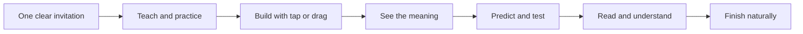
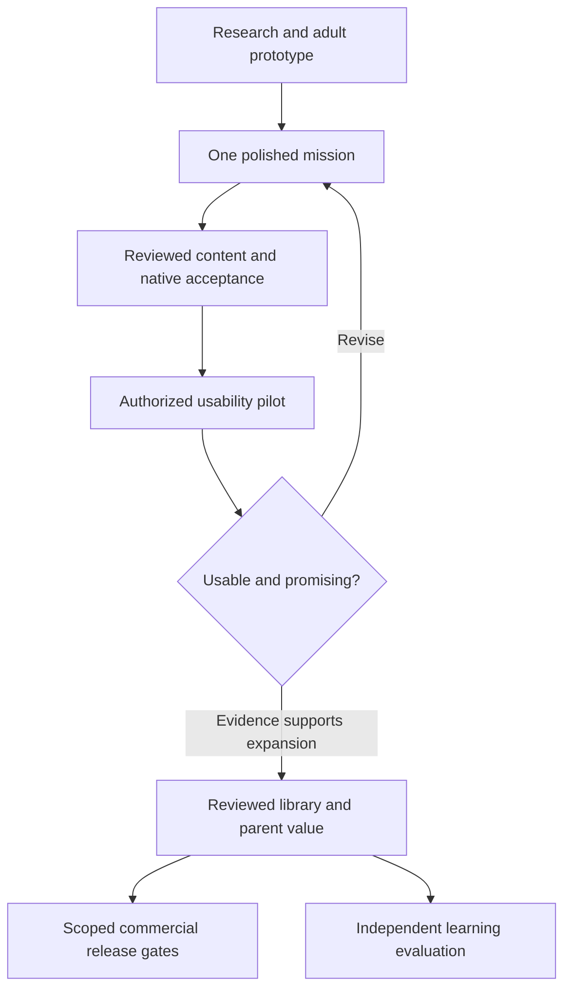

# Product excellence roadmap

Research: 2026-09-12. Re-scoped: **2026-09-13 UTC**, after merged PR #11.
Status: **evidence-backed proposal and durable product target for Read to Lead**.
The owner requested research, a stored roadmap and useful development plugins.
The research installed development tools and produced the plan; the premium mission
below is not implemented or validated. The current revision also applies the owner's
provisional display rename. Existing [design](design.md) and
[implementation status](implementation-status.md) remain the product baseline and
delivery record. The [mobile readiness plan](mobile-readiness-plan.md) owns legal,
privacy, human-review and store-release gates.

**Naming blocker:** [the name review](product-name-review.md) found existing literacy
products and store listings using Read to Lead or close variants. Use Read to Lead
provisionally in the local prototype; final identity needs clearance or a new name.
Keep the repository and technical identifiers unchanged until that decision.

**Target:** a beautiful, responsive, accessible offline reading adventure in which
reading has a purpose, children can act with growing independence, and learning
transfers beyond the game. Compete with acclaimed apps on a measured complete
experience. Do not equate a larger feature list, more animation or more screen time
with quality. Market leadership and reading efficacy are outcomes to earn.

## Decisions from the research

1. Keep explicit, cumulative phonics with oral language, meaning and connected
   reading. Use a Montessori-inspired prepared workspace and bounded choice, with
   STEM-style prediction and testing. This combination is a design inference;
   Montessori school outcomes do not establish app outcomes.
2. Produce one excellent 2D workshop mission before expanding the content library.
   Reading should enable a visible action. Preserve quiet attention during sound
   models and decoding; use original art and purposeful animation for the payoff.
3. Keep Expo/React Native and use the installed Reanimated/Gesture Handler stack
   properly. Add a rendering engine only after an equivalent scene proves its
   value on the actual supported devices.
4. Measure learning, usability, technical performance and business health separately.
   Independent unfamiliar-word reading matters more than reward counts. A small
   family pilot establishes feasibility, not causal learning gains.
5. Use bounded specialist assignments and human review. The needed capabilities
   are now largely available; an always-running multi-agent platform is not a
   prerequisite for the next product increment.

The [learning and experience research](learning-and-experience-research.md) records
methods, numerical findings, limitations, contrary evidence and five comparison
apps. The [tools and workflows decision record](development-tools-and-workflows.md)
records installed plugins, dependency choices and role assignments. These documents
are the supporting evidence; this roadmap owns priority and acceptance targets.

## Starting point and quality gap

This revision was checked against **[PR #11](https://github.com/jradriguez/read-and-lead/pull/11),
“Harden mobile privacy and verify native prototype builds,” merged at 2026-09-13
05:37:14 UTC**, and local/remote main `8058782139ad104b427171b280ee5d49201c35cf`.
It also incorporates PR #10's current repository guidance. The initial research
draft was based on `28a1d5c`; the following baseline supersedes its setup assumptions.

Credit PR #11 for installed native tools, successful iOS/Android debug builds,
ordered two-lesson tap/restart/gate Maestro smoke tests, build-input inventories,
backup/permission controls, SQLite deletion tests and Android Back handling.
Use the existing [native-tools wrapper](../scripts/native-tools.sh) and
[toolchain record](toolchain.md); do not reinstall tools or rebuild those controls
as new roadmap features. Debug clients depend on Metro and do not establish a
standalone offline release, physical-device performance or child readiness.

| Area | Existing evidence | Gap that matters next |
| --- | --- | --- |
| Instruction | Two cumulative draft mini-lessons, outcome categories and content gates | Final human-reviewed teaching sequence, accurate licensed recordings, full spoken navigation and meaningful transfer assessment |
| Interaction | Ordered native tap flows complete both lessons on iPad simulator and Android API 36 tablet emulator; Android Back has regression coverage | Drag completion and physical pan recognition remain unverified. Per-move React state in [LetterTile](../src/features/lesson/LetterTile.tsx) is avoidable work; this is not proof of the missing-pan root cause |
| Presentation | Original native-shape robot, shared tokens, native-driven bounce and reduced-motion support | Cohesive environment art, distinct meaningful reactions, tactile placement, narrative payoff and complete audio direction |
| Persistence | Separate-connection SQLite deletion tests, parent retention/reset information, native reward persistence across restarts and invalid-gate rejection | Physical backup/transfer, sidecar/reset/error cases and complete installed offline acceptance |
| Platforms | Native tools installed; iOS Debug simulator and Android ARM64 debug builds and smoke tests recorded; native dependency and privacy evidence captured | Reviewed standalone release, actual iPad/Samsung device evidence, screen-reader checks and representative performance baselines. Android alignment checks are not execution on a 16 KB device |
| Product evidence | Design and engineering prototype | No child usability, independent learning outcome, willingness-to-pay or competitive native benchmark evidence yet |

Current app dependencies already include Reanimated 4.5.1 and Worklets 0.10.1.
[LetterTile](../src/features/lesson/LetterTile.tsx) routes pan updates to JavaScript
and sets React state each movement. The first performance task should move visual
tracking to shared values while preserving one semantic placement path. Review
asynchronous slot measurements in [WordBuilder](../src/features/lesson/WordBuilder.tsx)
for stale activity/layout callbacks. Reproduce and test the failure before claiming
either change fixes native gesture recognition.

## First premium mission: Sam's Test Bench

This is a **draft art/interaction brief**, using the existing `m/a/s/t`, `mat` and
`Sam sat.` material. No new curriculum is approved by this document. Resolve who
Sam is and whether each instruction/meaning is clear during human content review.

| Beat | Learner experience | Quality and instructional requirement |
| --- | --- | --- |
| Arrive | Friendly robot indicates a missing test pad in a warm workshop | One obvious narrated start action; predictable replay and exit; no reading-dependent menu |
| Learn and build | Large letter tiles on a calm work surface; demonstration followed by a word-building turn | Crisp, stationary letterforms; tap-select/tap-place and drag give equivalent results. Building from a spoken model is practice/encoding, not proof of independent spoken decoding |
| Make it useful | After the attempt, show the mat's meaning and fit the pad into the bench | The reading-related work has a visible purpose. A cosmetic choice may create ownership without affecting difficulty or earning extra assessment credit |
| Predict and test | The learner predicts what happens and taps Test; the robot settles onto the pad | Short authored cause/effect animation. No physics engine or expanded science curriculum is needed for this small experiment |
| Understand and finish | Human-reviewed connected text, such as `Sam sat.`, and the completed bench | Separate modeled/replayed reading from an independent opportunity. Obvious Done, preserved progress and optional replay; no forced next lesson |

### Art, motion and sound production brief

- **Art:** one original modular robot and expression sheet, one layered workshop,
  one foreground bench and one mat/pad. Warm painted wood/enamel/paper textures
  belong around the task; learner text sits on a quiet cream surface. Use the
  existing sky/ink/blue/mint/yellow palette deliberately.
- **Layout:** keep a rich peripheral setting and a clear work area. Landscape may
  place the robot beside the task; portrait/phone layouts move it above and simplify
  decoration. Preserve target size instead of shrinking a whole tablet canvas.
- **Typography:** review lowercase forms and contrast; never deform letters or put
  moving facial features inside a grapheme during an attempt. Selection and errors
  need shape/outline and readable feedback, not color alone.
- **Motion:** immediate press feedback, a short lift/snap/settle for placement,
  distinct neutral/support/celebrate poses, and a proposed 1–2-second test payoff.
  Pause decorative idle motion during speech and reading. These are craft targets,
  not research-established optimal durations.
- **Sound:** one warm narrator with human-reviewed US-English phoneme models;
  preserve consonants without added vowel sounds. Speech has priority over music
  and effects. Quiet response time is acceptable. Replay and interruption must
  remain reliable; synthetic development phonemes are not final recordings.
- **Accessibility:** retain at least 56 logical-pixel targets, visible focus and
  logical reading order, tap alternatives and equally meaningful reduced-motion
  states. Test actual physical size, text scaling, VoiceOver/TalkBack and motor
  access on the target hardware. Native controls remain accessible if canvas art
  is introduced later.
- **Asset handoff:** retain editable originals, export settings, creator/source,
  redistribution rights, version/hash and human review. A concept image is not a
  production-ready rig, sprite atlas, licensed recording or approved lesson.

The sensory direction follows the evidence for relevant multimedia and uncluttered
child interaction in L10–L11 of the research report. The specific scene, palette
and timings are original proposals. [W3C's drag-alternative guidance](https://www.w3.org/WAI/standards-guidelines/wcag/new-in-22/)
is also a useful accessibility reference, although web criteria alone do not
certify a native children's app.

## Measurable technical quality targets

All thresholds below are **initial team targets, not measured results, platform
mandates or validated child-readiness standards**. Benchmark them on the lowest
device the product actually intends to support, then explicitly revise the supported
device floor or the implementation. Do not quietly relax a failed target. A flagship
simulator is not the reference device. Start with 60 Hz; 120 Hz is a later capability
where hardware and measurements support it.

| Measure | Proposed acceptance target | Measurement boundary |
| --- | --- | --- |
| Touch acknowledgement | p95 ≤100 ms from touch to visible response; drag tracking p95 ≤50 ms | Measure actual display response, not only handler execution |
| Frames during interaction | At least 95% within the 60 Hz/16.67 ms deadline; <1% exceed 33.3 ms | Use native frame timing/overrun and dropped-frame evidence; average FPS hides stalls |
| Bundled audio | p95 ≤250 ms prepared-prompt onset; ≤500 ms first playback; no stale/overlapping speech | Time audible output separately from a successful `play()` call |
| Startup | p95 ≤3 s cold and ≤1 s warm to usable workshop | Record first display and usable-ready separately; define cold process launch versus warm resume |
| Memory stability | No sustained retained-growth trend; after 20 complete lesson cycles, return within max(10 MiB, 10%) of warmed baseline | Observe after returning to workshop and settling; inspect retained players/animations as well as total footprint |
| Endurance | Thirty-minute adult synthetic repeat run: no crash, ANR, serious/critical thermal event or audio failure; <20% p95 latency deterioration | Record battery/charging/thermal conditions; this is a stress test, not a proposed child session length |
| Offline integrity | All reviewed lesson paths, first offline launch, save/restart and replay work without network | Installed build, not Metro/Expo Go; app traffic and OS traffic must be distinguished |
| Recovery | No lost or duplicate committed attempts/parts in the defined interrupt/save-retry cases | Exercise actual database behavior and force-close/reopen; mock tests are only one layer |
| Accessibility | All essential actions complete through tap and assistive paths; no blocked instruction or lost reward with reduced motion | Manual/native assistive testing plus automated semantics; note skill-assessment implications of spoken labels |

Collect at least 30 startup samples and 100 touch/audio events per device for an
initial batch; repeat after cooling. Report sample counts, p50/p95, worst case,
failure counts and raw local measurements. Small samples give unstable tail
estimates: increase the sample before interpreting rare stalls or claiming p99
reliability. Do not infer a population crash-free percentage from a short clean run.

Record build/source identity, binary hash, device/model/RAM/OS/refresh rate,
orientation, accessibility settings, power/thermal state and test procedure. Use
release-build measurements for production acceptance. Development profiling can
locate problems while reviewed content is pending; it cannot satisfy release
budgets, and the strict content gate must remain intact.

Use [React Native 0.86 performance guidance](https://reactnative.dev/docs/0.86/performance),
Apple Instruments and [XCTApplicationLaunchMetric](https://developer.apple.com/documentation/xctest/xctapplicationlaunchmetric),
and [Android Macrobenchmark metrics](https://developer.android.com/topic/performance/views/benchmarking/macrobenchmark-metrics-views)
with Perfetto where applicable. Physical iPad acceptance needs human/native Apple
testing: [Maestro's supported platforms](https://docs.maestro.dev/get-started/supported-platform.md)
cover iOS simulators and Android devices/emulators. Functional automation timings
do not substitute for frame/audio instrumentation.

## Prioritized delivery sequence

Each row is a bounded work package, not a separate required commit. Estimates are
planning allowances for focused work, exclude external waiting and professional
production costs, and should be revised after a baseline. They overlap existing
M1/readiness work; do not add them blindly to that plan's totals. Roles are
responsibilities to assign, not claims that specialists have been hired.

| ID / priority | Deliverable and likely scope | Owner / dependency | Exit evidence / planning allowance |
| --- | --- | --- | --- |
| EX-00 / final identity blocked | Resolve the documented Read to Lead / Read 2 Lead conflicts; use provisional display wording meanwhile | Owner + qualified trademark reviewer; independent of engineering | Cleared/accepted final name and written rationale for intended goods/markets before final brand investment or repository/ID migration; external review separately scoped |
| EX-01 / setup complete, measurement next | Reuse PR #11's native tools/debug clients and select actual oldest-target iPad plus representative low/mid Samsung tablet/phone; capture a baseline | Native engineering + owner; P1 debug setup already delivered | Actual device floor and reproducible measurements, with build mode recorded; 1–2 days baseline work plus hardware availability. Release measurements wait for reviewed content |
| EX-02 / first | Replace per-move React state in LetterTile with shared-value transforms; inspect WordBuilder stale geometry and cancel/disabled/scroll behavior | Interaction engineer; can start locally while EX-01 prerequisites are resolved | Reproduced gesture behavior, one semantic placement, equivalent tap, cancellation/rotation regression and native trace showing improvement; 2–4 days plus device availability |
| EX-03 / parallel | Final teaching/audio brief for the two lessons, complete spoken navigation and rights/reviewer schedule | Literacy lead + audio producer; content-review process | Exact wording/phonemes reviewed by a qualified human, licensed final files and current content digests before child use; 1–2 days brief, production/review separately estimated |
| EX-04 / parallel | Sam's Test Bench storyboard, original character/environment direction, six meaningful poses and static equivalents; keep artwork independent of the final wordmark | Art/interaction lead; EX-03 meaning/sequence constraints; EX-00 before final branding | Adult visual review on iPad portrait/landscape and phone, editable handoff and scoped export plan; 2–4 days concept work, final production separately estimated |
| EX-05 / next | Implement one full mission using existing renderer and bounded audio lifecycle; include natural exit and storage recovery | Native engineer; EX-02/03/04, with drafts allowed only in adult development | Complete native loop, no overlap/stale audio, interruption/restart/tap parity, no performance regression; 3–6 days after assets and scope settle |
| EX-06 / conditional | Compare one rigged Rive character or a specific Skia/Lottie effect against EX-05 only if authoring/rendering needs warrant it | Graphics engineer + art lead; baseline and concrete asset first | Same scene, build mode and devices; acceptable fidelity, accessibility, size/memory/timing and total production cost. Choose one solution or retain baseline; 1–2 days per approved comparison |
| EX-07 / gate | Complete physical offline/privacy/accessibility acceptance and matched adult competitor walkthrough; build on PR #11's implemented controls and smoke evidence | QA + accessibility reviewer; EX-01–05 and readiness P2/P3 | Technical targets, app-attributed traffic/backup-transfer checks and native audio/lifecycle/assistive evidence; strict content/release checks and human review; 2–4 days test work plus remediation |
| EX-08 / pilot | Authorized small feasibility pilot and exploratory transfer/retention procedure | Owner + literacy/research lead; all child-use gates | Navigation/help/frustration/ending findings, private data handling and explicit expand/revise decision. Use research report's sample/timing assumptions; not an efficacy claim |
| EX-09 / expansion | Plan ten reviewed lessons and a third meaningful reading mechanic; preserve reusable art/audio/interaction patterns | Product + content + engineering; EX-08 evidence | Reviewed content coverage and production-throughput estimate; a new scoped M2 plan. Optional microphone is not a prerequisite |
| EX-10 / business and release | Validate parent value and pricing; build M3 content/support/store evidence; plan independent efficacy evaluation proportionate to claims | Owner + product/research/release roles; EX-00/08/09 and readiness gates | Final identity, evidence-based scope and economics, current channel requirements, independent review and explicit release decisions; separately estimated |

The smallest useful next implementation is **EX-02: responsive, reliable letter
placement**, with EX-01 physical-device baselining and EX-03 content planning alongside
it. It uses installed runtime dependencies and addresses an observed code cost.
Do not begin a full engine migration, expand to 30 lessons or recruit families
before these uncertainties are resolved.

## Decision gates and product measures

The [research report](learning-and-experience-research.md) contains the study proposal;
the [workflow record](development-tools-and-workflows.md) contains production and
business metrics. Apply this decision sequence:

For the small pilot, a proposed navigation target is at least 90% of observed
eligible core-task attempts completed without adult **navigation rescue**, with
intentional instructional help recorded separately. Report the actual numerator,
denominator, context and exclusions. This is a team usability target, not a validated
norm, a reason to deny help or an automatic child-use approval. Any serious distress,
misleading instruction, data loss or inaccessible essential action triggers review
regardless of the aggregate score. A voluntary stop is not a failed session.

Do not set a learning-gain threshold from a competitor advertisement or a meta-analysis
average. Define a meaningful independent primary outcome with a qualified researcher.
Use unfamiliar combinations of taught patterns, connected understanding and delayed
retention to examine transfer. Preserve ordinary teaching/shared reading, and account
for the caregiver support the app requires. Before public learning claims, document
the study population, comparator, version, effect uncertainty and limitations.

Prioritize investment by the next decision it resolves: accurate recordings and
literacy review; native tools/devices and accessibility; a coherent original art/audio
package; then broader content and distribution. The existing design's monetary
figures are hypotheses, not quotes. This roadmap authorizes no purchase or enrollment.
Publisher identity, actual hardware, professional reviewer availability, budget and
production capacity remain open inputs to the schedule.

## Handoff and maintenance

Update work-package status here only when execution evidence exists; record actual
checks in the appropriate dated validation/device records. Research or new dependencies
may change the recommendation. Revisit the relevant source when changing pedagogy,
entering a new market or adopting a native package; store claims and package peers
are especially version-sensitive. Review contrary findings, not only positive studies.

The three installed Codex plugins are development tooling. This revision changes
the provisional workshop heading and Expo display name alongside documentation;
runtime dependencies, curriculum, permissions, native identifiers, schemas and CI
are unchanged. Existing PR #11 binary records describe the earlier display name;
the new native launcher label requires regeneration/build verification.
No child trial, paid service, outreach, store submission or recurring automation was
started. The existing child-use and release blockers remain explicit.

### Validation and provenance

The original four-document research commit is `3b613a0` on
`docs/product-excellence-roadmap`, validated against `28a1d5c`. Its source review
checked selected study figures, WWC qualifications and technical boundaries with
no material findings. This revision brings the three research documents into the
current checkout on `feat/read-to-lead-roadmap`, starting at merged PR #11's
`8058782`, and updates README navigation. Earlier checks are historical evidence,
not validation of this revision.

| Check on this revision | Observed result |
| --- | --- |
| Resolved Expo configuration and source heading | Passed: Read to Lead; `app.json` changes only the name. Existing slug and both native identifiers retained. |
| `npm run validate:code` | Passed: lint, strict types, 47 unit tests, 20 UI tests in five suites and repository boundaries. |
| `npm run security:check` | Passed: npm audit found zero vulnerabilities; Gitleaks history and directory scans found no leaks. |
| Documentation references | Passed: local file targets and npm script references checked across all 24 changed Markdown files. |
| Plugin inventory | Expo 1.0.2, Building React Native Apps 0.2.0 and Testing React Native Apps 0.1.0 remain installed and enabled. No further install was needed. |
| `npm run content:check` | Failed as expected: `UNAPPROVED_LESSON`, `UNAPPROVED_ASSET`, and `REVIEW_DIGEST` for `first-sounds` and `first-words`. Release remains blocked. |
| Full `npm run validate` wrapper | Not run separately; code and strict-content components were run, and strict content failed. |

Whitespace and staged-scope checks are recorded at commit handoff. Native binaries
were not regenerated/rebuilt in this revision; the new launcher label still needs
native verification. The bounded naming research verified three live official
records and public-use sources; it did not establish legal name availability.

Native smoke/build evidence from PR #11 remains in [validation](validation.md) and
[device validation](device-validation.md). No new physical-device benchmark,
competitor playthrough, human content approval or child test is part of this change.
